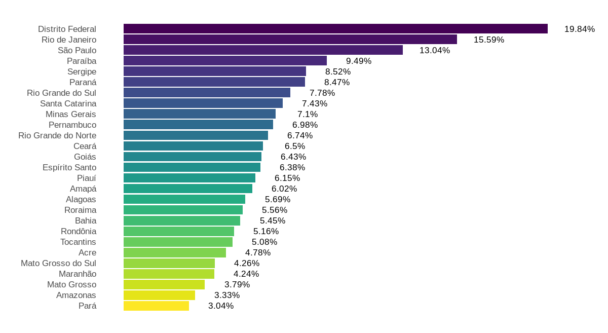
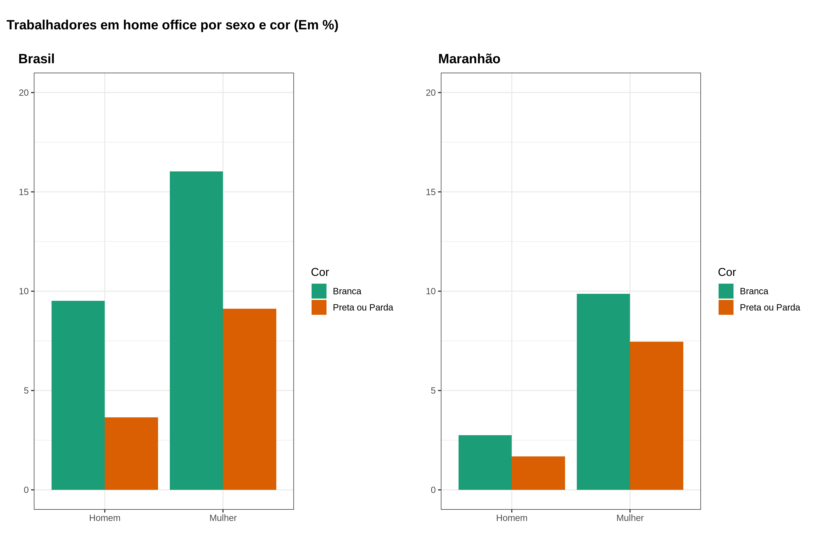
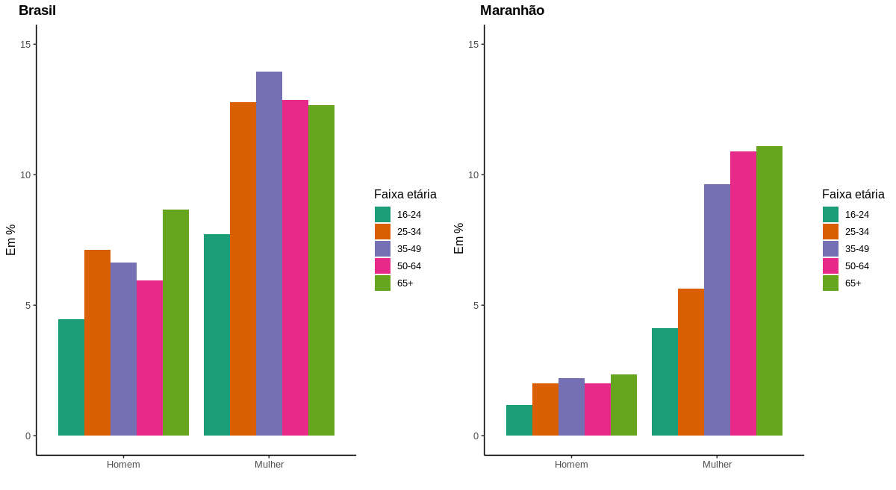
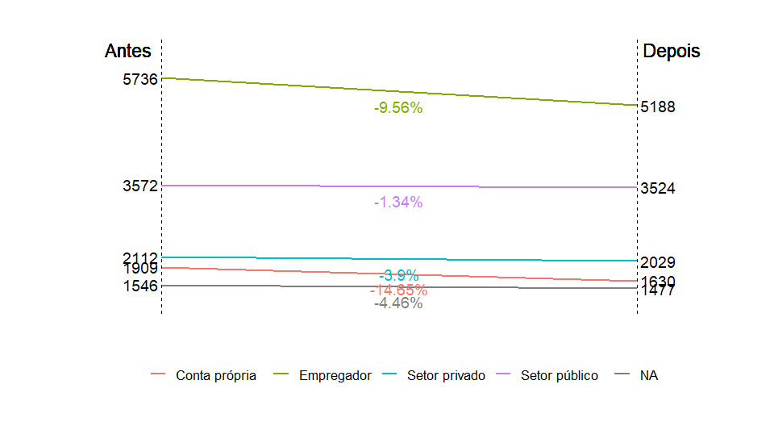

```{r setup, include=FALSE}
knitr::opts_chunk$set(echo = FALSE, 
                      fig.width = 4, fig.height = 6)

```

```{css, echo = FALSE}
body {
  text-align: justify;
}
```

Acaba de ser publicado pela editora Annablume o livro [**Trabalho & Pandemia**](http://www.annablume.com.br/loja/product_info.php?products_id=2355&osCsid=ek3lhi26d52qb4ko9dlm99sj12), organizado por Roberto Veras e Ari Rocha da Silva, no qual há um capítulo que escrevi com Marcelo Sampaio Carneiro e Clenilson Trindade, intitulado do **Do Home Office ao Associativismo: impactos da pandemia da Covid-19 no mercado de trabalho maranhese**.

{width="8cm"}

O capítulo do livro apresenta o resultado de duas pesquisas realizadas com o objetivo de compreender os efeitos da pandemia do coronavírus (Covid-19) no estado do Maranhão, especialmente as situações em que trabalhadores e trabalhadoras passaram a exercer suas atividades de forma remota (*"home office"*). Os dados mostram que as mulheres brancas, trabalhadores com nível superior ou pós-graduação e, de forma predominante, servidores públicos tiveram condições de se afastar das atividades de trabalho, o que não ocorreu com a grande massa de trabalhadores informais do estado.

Nesta pesquisa usamos dados da Pnad Covid. Ao trabalhar com amostras complexas como as pesquisas do IBGE, a grande questão - e fonte de inúmeros problemas - é fazer a identificação correta das variáveis no momento de carregamento dos dados. Para isso, temos que consultar no dicionário de dados qual é a variável de ponderação.

Assim, fizemos o carregamento dos dados da seguinte forma:

```{r eval=FALSE, results='hide', echo=TRUE}
###### Dados de novembro de 2020

pnad_url <- paste0("ftp://ftp.ibge.gov.br/Trabalho_e_Rendimento/Pesquisa_Nacional_por_Amostra_de_Domicilios_PNAD_COVID19/Microdados/Dados/PNAD_COVID_112020.zip")

#Baixar e descompactar 

download.file(pnad_url, "pnad_covid.zip")
unzip("pnad_covid.zip")

# Leitura dos dados baixados e já pasta de trabalho
pnad <- read_csv( 
  "PNAD_COVID_112020.csv", 
  col_types = cols(.default = "d") 
)

# Leitura dos estados indicados no dicionario, que deve ser baixado manualmente.
estados <- read_excel( 
  "Dicionario_PNAD_COVID_112020.xls",  
  sheet = "dicionário pnad covid", 
  skip = 4, n_max = 27 
) %>% 
  select(UF = ...5, estado = ...6)

# Join dos dados
pnad <- pnad %>% 
  left_join(estados, by = "UF")

# Agora fazemos a leitura e ponderação das variáveis, seguindo o dicionário de dados e informações da pesquisa. 

pnad_design <- pnad %>% 
  as_survey_design(   # Transforma em um objeto do tipo survey
    ids = UPA, 
    strata = Estrato, 
    weights = V1032, # Pondera com a variação de peso, conforme dicionario
    nest = TRUE 
  )

```

Pronto! Agora os dados estão disponíveis para manipulação. O pacote tradicional de manipulação de dados complexos é o `survey`. O problema é que as funções e rotinas, sobretudo para criação de gráficos, não são intuitivas. Por isso o desenvolvimento do pacote `srvyr` é um grande avanço, já que segue a lógica do Tidyverse e se integra ao `ggplot2`para criação de gráficos.

Verificou-se que a possibilidade de trabalhar em *home office* durante a pandemia não foi a mesma para todos os trabalhadores nos estados da federação. No Distrito Federal, onde há enorme concentração de servidores públicos, esse percentual foi o mais alto: 19,84%, já indicando um padrão que seria observado no tipo de atividade normalmente desenvolvida à distância.  Na sequência ao DF, o Rio de Janeiro apresentou o segundo maior percentual de empregos em *home office*: 15,59% dos trabalhadores, seguido por São Paulo, com 13,04%.

Houve, portanto, um ajuste mais célere das atividades ao *home office* em estados com maior concentração de servidores públicos e com economias com forte presença do setor de prestação de serviços.



O Maranhão apresentou um dos piores resultados em relação à migração das
atividades para a modalidade de *home office*: 4,24% apenas, como se observa na Figura 1, o que pode ser explicado pela estrutura econômica do estado, ainda bastante dependente da economia de *commodities* e de atividades agrícolas tradicionais para ocupação da sua força de trabalho e também como colchão amortecedor das vulnerabilidades sociais.

Ao trabalhar com vários gráficos, optei em utilizar o pacote `cowplot` para organizar organizar e compará-los visualmente mais facilmente, como nos gráficos a seguir.



Ao se investigar o perfil dos trabalhadores em *home office* no Brasil, verifica-se que a força de trabalho nessa condição era formada por 7.189.430
trabalhadores. Desse montante, as mulheres brancas constituíam a maioria, ou
seja, uma população de 2.639.757 que correspondia à 16% da população.

Os homens brancos aparecem na sequência, com percentual ligeiramente superior ao de mulheres negras (9,5% e 9,1%, respectivamente), como se observa na figura anterior.

No
Maranhão, por sua vez, os trabalhadores em *home office* no mesmo período totalizavam
887.225. O mesmo padrão se observa em
relação à distribuição por sexo e cor no contexto nacional, com as mulheres
representando o maior número de pessoas nessa condição, sendo as mulheres
brancas o grupo de maior percentual (9,8% ou 179.243 pessoas). Apesar disso,
deve-se observar que no Maranhão há uma proporção significativamente mais baixa
de trabalhadores que dispõem dessa possibilidade, como se observa na Figura 3
para o Brasil e Maranhão.

Ao analisar
a distribuição por escolaridade no Brasil na figura 4, verifica-se a concentração
de trabalhadores com pós-graduação em *home office*, seja entre brancos
(41%) ou pretos e pardos (38%). Em seguida, os trabalhadores com ensino
superior integram o segundo grupo com mais pessoas no trabalho remoto, seguindo
a mesma lógica de distribuição entre brancos (22%) e pretos e pardos (22%).
Assim, quanto menor a escolaridade dos trabalhadores, menor a possibilidade de
realização de atividades fora do espaço laboral tradicional.


No Maranhão, verifica-se
que o padrão é mantido, com mais trabalhadores possuindo pós-graduação e a possibilidade
de realizar atividades laborais na modalidade remota. Assim, observa-se que os
trabalhadores brancos e com pós-graduação representam 31% do total de pessoas
nessa condição, alcançando os pretos e pardos 29%. Da mesma forma, os
trabalhadores com ensino superior constituem o segundo grupo mais expressivo em
*home office*, novamente com os brancos em situação ligeiramente superior
(17% contra 15%). Dessa forma, a expectativa de trabalho remoto, no Brasil e no
Maranhão, está concentrada para os grupos mais escolarizados.



No
Maranhão, o salário médio recebido por empregadores teve uma redução de 7.94%,
sendo que entre os trabalhadores por conta própria essa queda foi de quase 7%. É
importante ressaltar que as duas categorias (empregadores e trabalhadores por conta
própria) foram as mais impactadas pela redução salarial média durante a
pandemia.

No capítulo do livro há mais detalhes sobre a renda, a distribuição da escolaridade por sexo e como os associados a grupos de trabalhadores rurais acionaram estratégias para mitigar os impactos da pandemia. Confiram lá!
