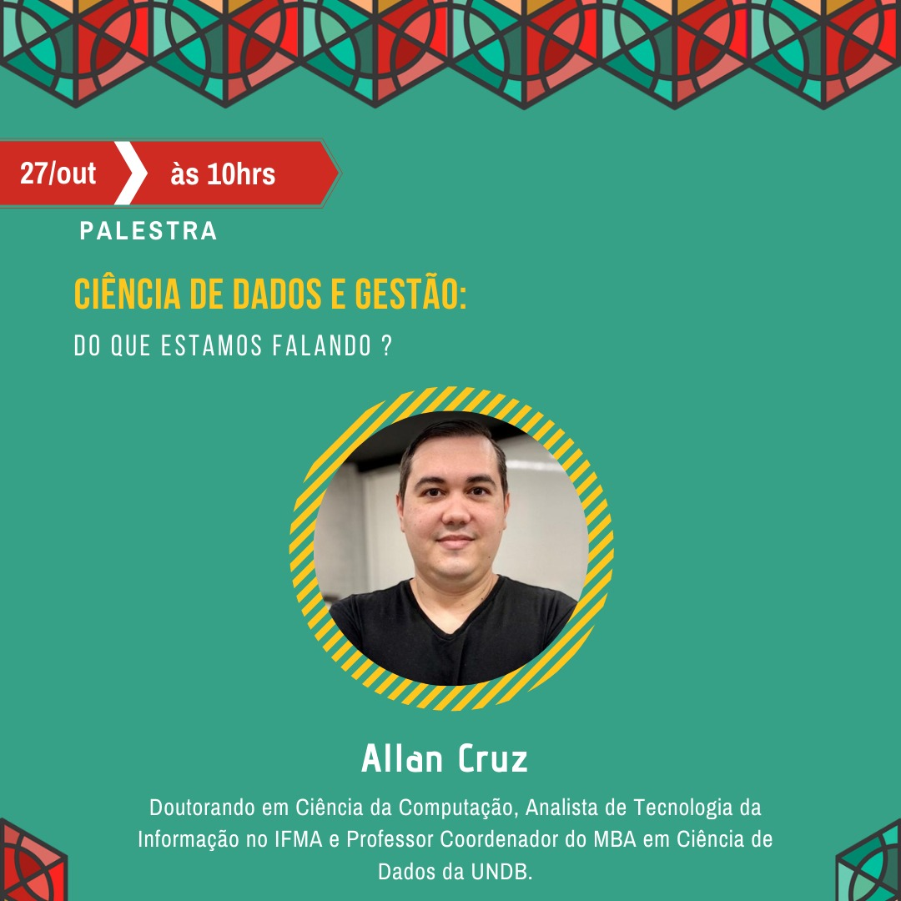
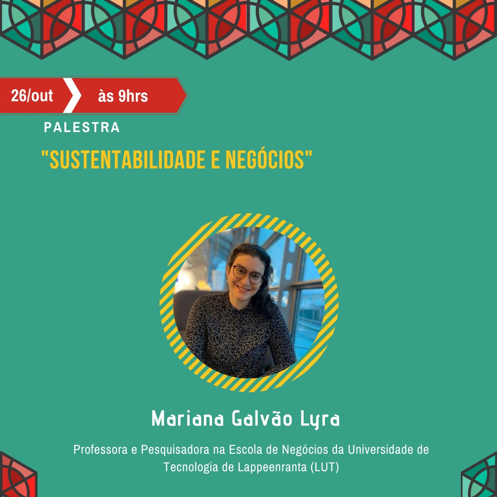
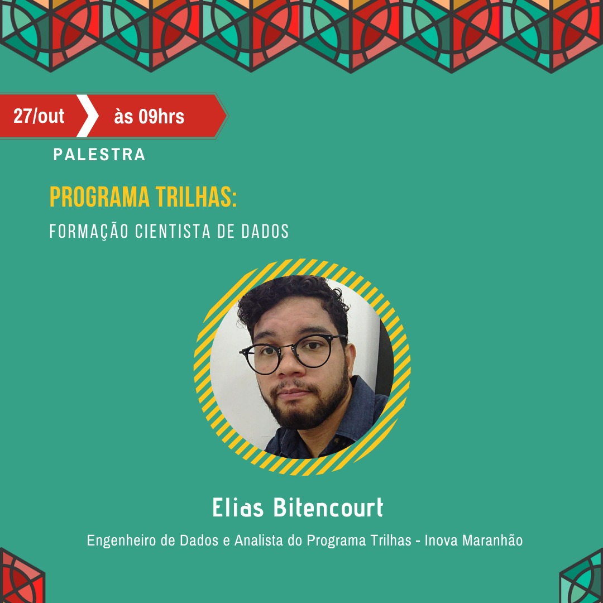
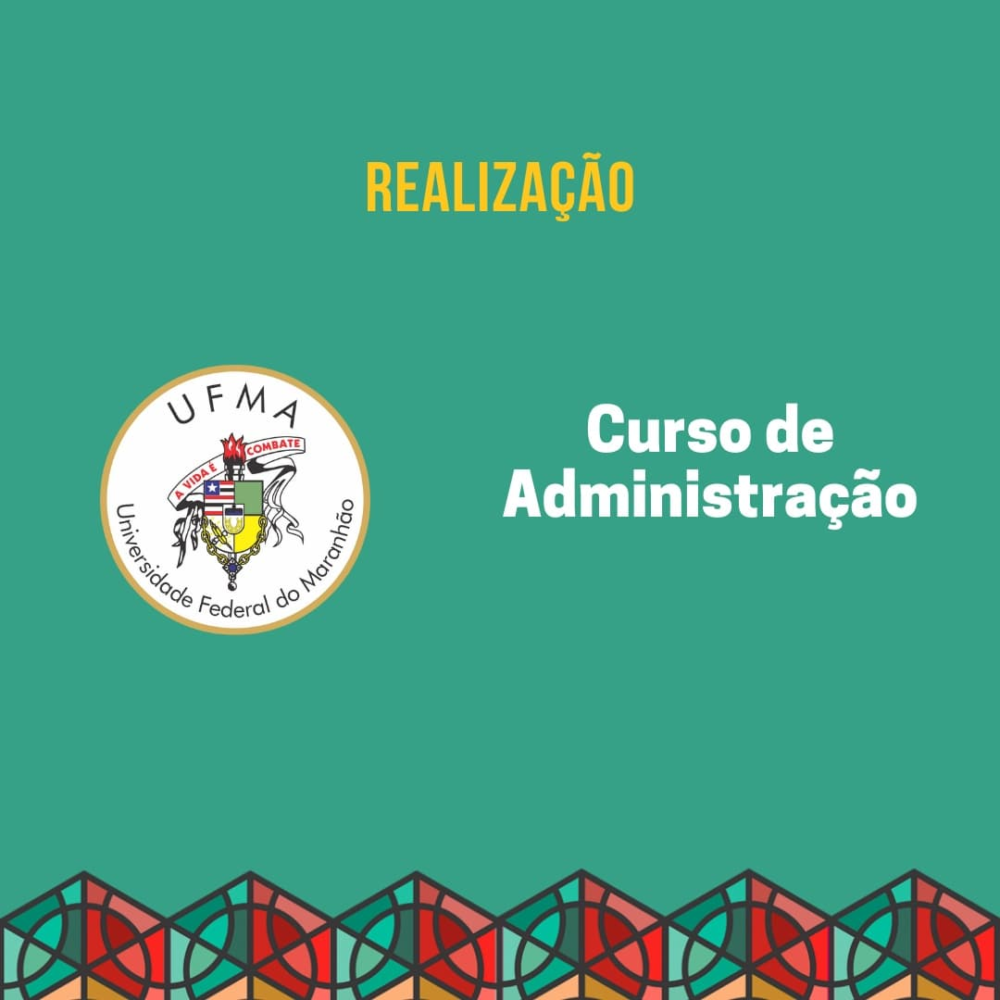

```{r setup, include=FALSE}
knitr::opts_chunk$set(echo = FALSE)

```

```{css}
body {

  text-align: justify;

}

```

## Semana de Administração da UFMA

A XIV Semana de Administração da UFMA, evento já tradicional da área de administração para os estudantes maranhenses, teve a sua edição realizada online neste ano.

Pensamos em palestrantes que pudessem apresentar, a partir da temática *Perspectivas Empresariais para o Maranhão*, um panorama da situação econômica e possibilidades de superação da crise. Além disso, o último dia do evento foi totalmente dedicado à Data Science e suas possibilidades no contexto organizacional.

[O evento, que ocorreu entre 25 e 27 de outubro, teve na mesa de abertura a coodenadora do curso, a Pró-reitora de Ensino, Profa. Isabem Ibarra, e o Pró-reitor de Planejamento e Gestão, Prof. Walber Pontes, representando a reitoria.](https://portais.ufma.br/PortalProReitoria/proen/paginas/noticias/noticia.jsf?id=58521)

Os vídeos do evento podem ser acessados no canal do [YouTube da Semana de Administração.](https://www.youtube.com/channel/UCoZolw1kHrvFrm2bDFdCC0A)

```{css}
<!DOCTYPE html>
<html>
<head>
<style>
div.gallery {
  border: 1px solid #ccc;
}

div.gallery:hover {
  border: 1px solid #777;
}

div.gallery img {
  width: 100%;
  height: auto;
}

div.desc {
  padding: 15px;
  text-align: center;
}

* {
  box-sizing: border-box;
}

.responsive {
  padding: 0 6px;
  float: left;
  width: 24.99999%;
}

@media only screen and (max-width: 900px) {
  .responsive {
    width: 49.99999%;
    margin: 6px 0;
  }
}

@media only screen and (max-width: 500px) {
  .responsive {
    width: 100%;
  }
}

.clearfix:after {
  content: "";
  display: table;
  clear: both;
}
</style>
</head>
<body>

<h3>Palestrantes da XIV edição da SEAD</h2>

<div class="responsive">
  <div class="gallery">
    <a target="_blank" href="images/Simplicio.jpeg">
      
    </a>
    <div class="desc"></div>
  </div>
</div>


<div class="responsive">
  <div class="gallery">
    <a target="_blank" href="images/Wilson.jpeg">
      
    </a>
    <div class="desc"></div>
  </div>
</div>

<div class="responsive">
  <div class="gallery">
    <a target="_blank" href="images/Mariana.jpeg">
      
    </a>
    <div class="desc"></div>
  </div>
</div>

<div class="responsive">
  <div class="gallery">
    <a target="_blank" href="images/Dionatan.jpeg">
      
    </a>
    <div class="desc"></div>
  </div>
</div>

<div class="responsive">
  <div class="gallery">
    <a target="_blank" href="images/Taborda.jpeg">
      
    </a>
    <div class="desc"></div>
  </div>
</div>

<div class="responsive">
  <div class="gallery">
    <a target="_blank" href="images/Elias.jpeg">
      
    </a>
    <div class="desc"></div>
  </div>
</div>

<div class="responsive">
  <div class="gallery">
    <a target="_blank" href="images/Allan.jpeg">
      
    </a>
    <div class="desc"></div>
  </div>
</div>

<div class="responsive">
  <div class="gallery">
    <a target="_blank" href="images/Joao.jpeg">
      
    </a>
    <div class="desc"></div>
  </div>
</div>

<div class="clearfix"></div>

</body>
</html>


```

```{html}

<head>

    <link type="text/css" rel="stylesheet" href="https://cdnjs.cloudflare.com/ajax/libs/lightgallery/1.6.0/css/lightgallery.min.css" />
    <script src="https://cdnjs.cloudflare.com/ajax/libs/lightgallery-js/1.4.1-beta.0/js/lightgallery.min.js"</script>

    <!-- lightgallery plugins -->
    <script src="https://cdnjs.cloudflare.com/ajax/libs/lg-fullscreen/1.2.1/lg-fullscreen.min.js"</script>
    <script src="https://cdnjs.cloudflare.com/ajax/libs/lg-thumbnail/1.2.1/lg-thumbnail.min.js"</script>

    </head>

    <div id="lightgallery">
      <a href="images/Dionatan.jpeg">
        
      </a>
      <a href="images/Mariana.jpeg">
        
      </a>
    </div>


```

Um agradecimento especial às professoras Adriana Araújo e Amanda Aboud que participaram da organização, bem como aos graduandos Geilson Pereira, Karoline Soares e Renata Pestana por todo o trabalho na organização do evento e pelo trabalho no [Instagram](https://www.instagram.com/seadufma/).

{width="5cm"}
